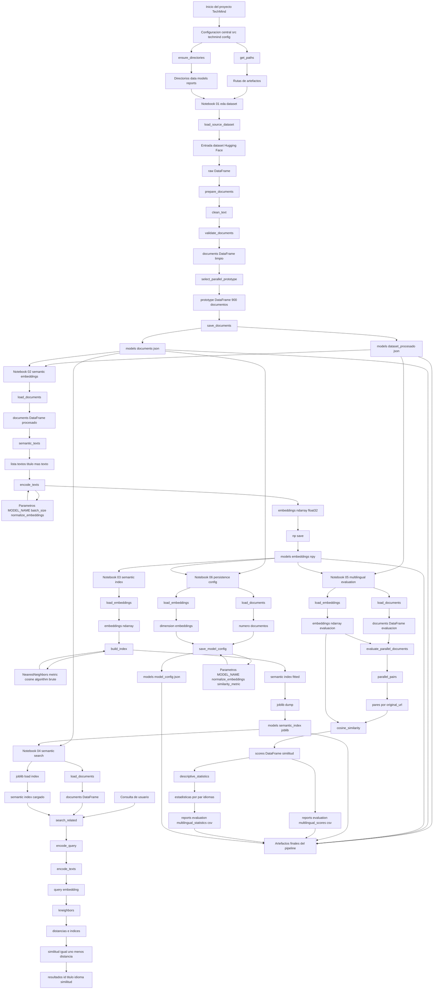
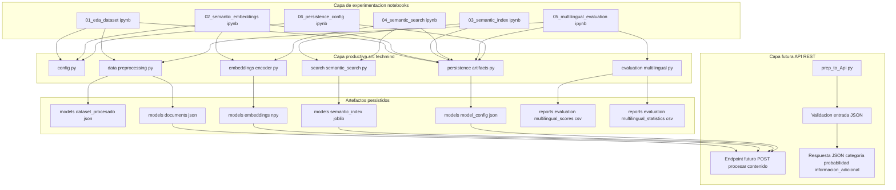
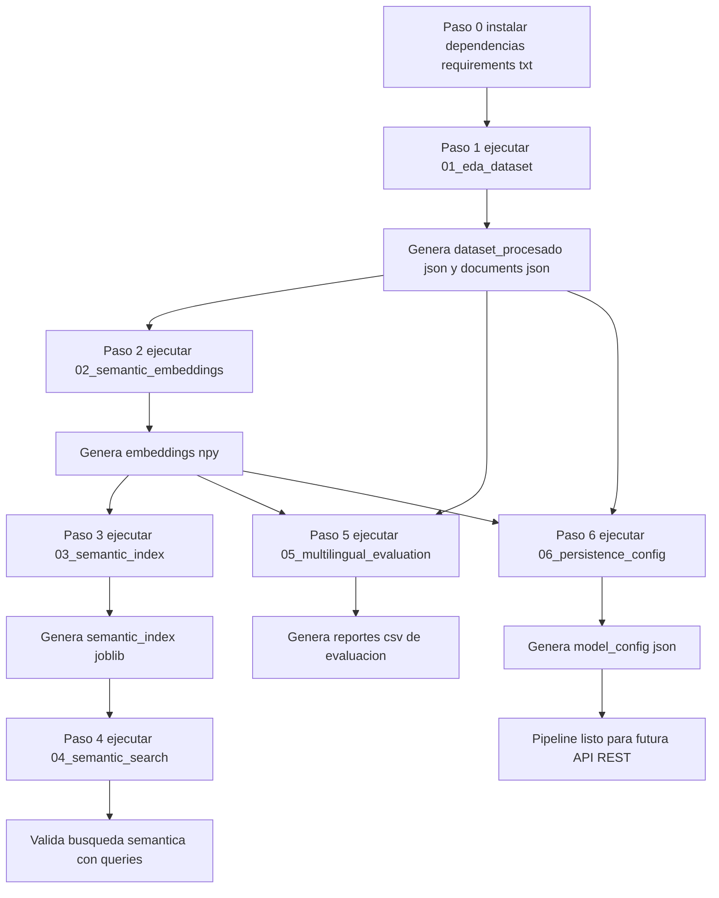
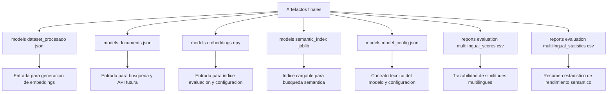
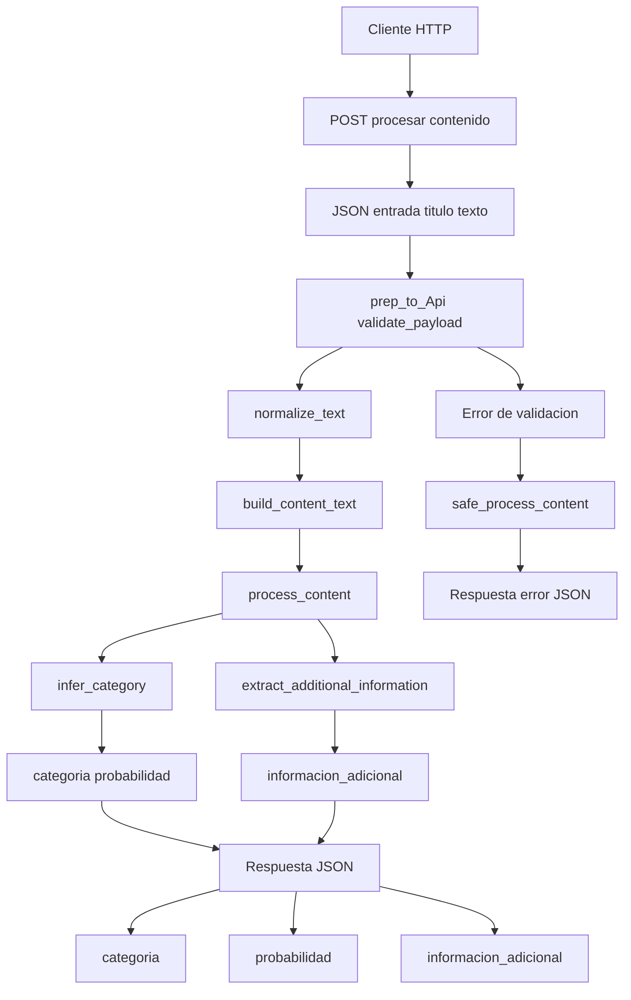

<archivo_diagrama>
# Diagrama técnico de arquitectura y flujo de ejecución

Este documento describe la arquitectura del pipeline de TechMind, el orden recomendado de ejecución y la concatenación entre notebooks, módulos productivos en `src/techmind`, entradas, salidas y artefactos finales.

## Flujo principal del pipeline

## Arquitectura por capas

## Encadenamiento detallado de datos y funciones

```mermaid
graph LR
    D0["Dataset remoto AI Culture Commons"] --> F1["load_source_dataset"]
    F1 --> D1["raw DataFrame"]

    D1 --> F2["prepare_documents"]
    F2 --> F2A["clean_text por columnas textuales"]
    F2A --> F2B["validate_documents"]
    F2B --> D2["documents limpio"]

    D2 --> F3["select_parallel_prototype"]
    F3 --> D3["prototype 300 grupos por 3 idiomas"]

    D3 --> F4["save_documents"]
    F4 --> J1["dataset_procesado json"]
    F4 --> J2["documents json"]

    J1 --> F5["load_documents"]
    F5 --> D4["documents cargado"]

    D4 --> F6["semantic_texts"]
    F6 --> D5["textos concatenados"]

    D5 --> F7["encode_texts"]
    C1["MODEL_NAME"] --> F7
    C2["NORMALIZE_EMBEDDINGS true"] --> F7
    C3["batch_size 32"] --> F7
    F7 --> D6["embeddings float32"]

    D6 --> J3["embeddings npy"]

    J3 --> F8["load_embeddings"]
    F8 --> D7["embeddings cargados"]

    D7 --> F9["build_index"]
    C4["metric cosine"] --> F9
    C5["algorithm brute"] --> F9
    F9 --> D8["indice semantico ajustado"]

    D8 --> F10["joblib dump"]
    F10 --> J4["semantic_index joblib"]

    J2 --> F11["load_documents para search"]
    J4 --> F12["joblib load para search"]
    Q1["query usuario"] --> F13["search_related"]

    F11 --> F13
    F12 --> F13
    F13 --> F14["encode_query"]
    F14 --> D9["query embedding"]
    D9 --> F15["kneighbors"]
    F15 --> D10["indices distancias"]
    D10 --> F16["calcular similitud"]
    F16 --> D11["DataFrame resultados"]

    J1 --> F17["load_documents para evaluacion"]
    J3 --> F18["load_embeddings para evaluacion"]
    F17 --> F19["evaluate_parallel_documents"]
    F18 --> F19
    F19 --> F20["parallel_pairs"]
    F20 --> D12["pares multilingues"]
    D12 --> F21["cosine_similarity"]
    F18 --> F21
    F21 --> D13["scores similitud"]

    D13 --> F22["descriptive_statistics"]
    F22 --> D14["estadisticas descriptivas"]

    D13 --> R1["multilingual_scores csv"]
    D14 --> R2["multilingual_statistics csv"]

    J2 --> F23["load_documents para config"]
    J3 --> F24["load_embeddings para config"]
    F23 --> D15["cantidad documentos"]
    F24 --> D16["dimension embeddings"]
    D15 --> F25["save_model_config"]
    D16 --> F25
    C1 --> F25
    C2 --> F25
    F25 --> J5["model_config json"]
```

## Orden recomendado de ejecucion

## Contrato de entradas y salidas por etapa

| Etapa | Componente ejecutor | Funcion principal | Entrada | Parametros relevantes | Salida |
|---|---|---|---|---|---|
| EDA y preparacion | `01_eda_dataset.ipynb` | `load_source_dataset` | Dataset remoto | `DATASET_NAME`, `DATASET_CONFIG`, `DATASET_SPLIT` | `raw DataFrame` |
| Limpieza | `src/techmind/data/preprocessing.py` | `prepare_documents` | `raw DataFrame` | `LANGUAGES` | `documents DataFrame` |
| Normalizacion textual | `src/techmind/data/preprocessing.py` | `clean_text` | valores textuales | Unicode NFC, regex de espacios | texto normalizado |
| Validacion | `src/techmind/data/preprocessing.py` | `validate_documents` | `documents DataFrame` | `FINAL_COLUMNS`, `LANGUAGES` | validacion o error |
| Seleccion prototipo | `src/techmind/data/preprocessing.py` | `select_parallel_prototype` | `documents DataFrame` | `PROTOTYPE_PER_LANGUAGE`, `RANDOM_STATE` | `prototype DataFrame` |
| Persistencia documentos | `src/techmind/persistence/artifacts.py` | `save_documents` | `prototype DataFrame` | ruta destino | `dataset_procesado.json`, `documents.json` |
| Representacion semantica | `02_semantic_embeddings.ipynb` | `semantic_texts` | documentos procesados | columnas `titulo` y `texto` | lista de textos |
| Vectorizacion | `src/techmind/embeddings/encoder.py` | `encode_texts` | lista de textos | `MODEL_NAME`, `batch_size`, `NORMALIZE_EMBEDDINGS` | matriz `embeddings` |
| Persistencia embeddings | `02_semantic_embeddings.ipynb` | `np.save` | matriz `embeddings` | `float32` | `embeddings.npy` |
| Indexacion | `03_semantic_index.ipynb` | `build_index` | `embeddings.npy` | `metric cosine`, `algorithm brute` | indice `NearestNeighbors` |
| Serializacion indice | `03_semantic_index.ipynb` | `joblib.dump` | indice ajustado | ruta destino | `semantic_index.joblib` |
| Busqueda | `04_semantic_search.ipynb` | `search_related` | query, indice, documents | `limit`, `MODEL_NAME` | resultados con similitud |
| Evaluacion | `05_multilingual_evaluation.ipynb` | `evaluate_parallel_documents` | documents, embeddings | `original_url` como relacion | scores por pares |
| Estadisticas | `src/techmind/evaluation/multilingual.py` | `descriptive_statistics` | scores | agrupacion por par de idiomas | estadisticas descriptivas |
| Persistencia de reportes | `05_multilingual_evaluation.ipynb` | `to_csv` | scores y estadisticas | rutas de reports | archivos CSV |
| Configuracion final | `06_persistence_config.ipynb` | `save_model_config` | documents, embeddings | modelo, normalizacion, metrica | `model_config.json` |

## Artefactos finales

## Flujo previsto para API REST futura

## Notas arquitectonicas

- Los notebooks actuan como orquestadores reproducibles de cada fase del pipeline.
- La logica reutilizable vive en `src/techmind`, lo que permite migrar progresivamente hacia una API REST sin duplicar codigo.
- El pipeline no entrena un clasificador supervisado. Usa un modelo preentrenado de embeddings y un indice de vecinos con distancia coseno.
- `semantic_index.joblib` es el artefacto serializado principal para busqueda.
- `model_config.json` registra el contrato tecnico necesario para que una API futura cargue los artefactos de forma consistente.
- `prep_to_Api.py` representa una capa preliminar de contrato JSON para la futura API REST.
</archivo_diagrama>
